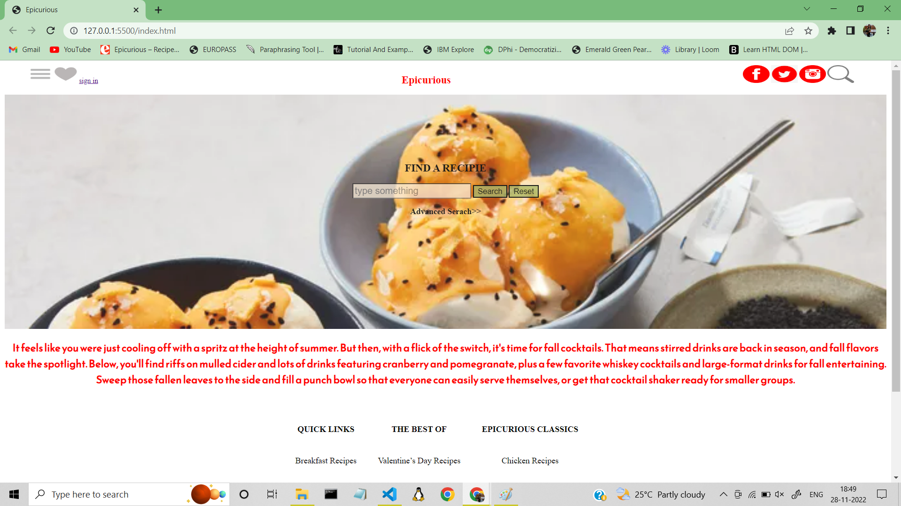

# Homepage-EPICURIOUS
The clone layout of a food recipe page called EPICURIOUS done as a part of daily workshop call by BigBinary Academy. The design is created using html and CSS.  
The blueprint of the website was created using Escalidraw. Excalidraw is a whiteboard tool that lets you easily sketch diagrams that have a hand-drawn feel to them.

Below is the design made using html and CSS

